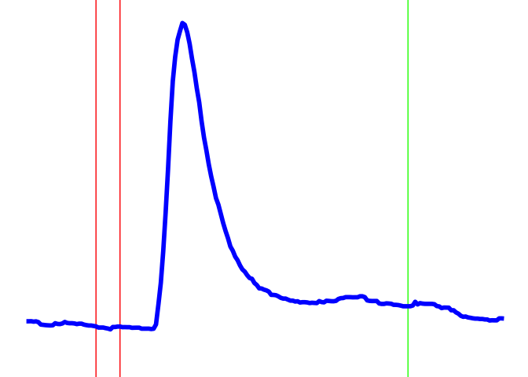

Calcium image
================

## Installation

``` r
#install.packages("openxlsx","ggplot2")
```

## Read input file and plot

``` r
suppressMessages(library(openxlsx))
suppressMessages(library(ggplot2))
File = "20211203_Ms4a2,6D.xlsx"
raw1 = read.xlsx(File, sheet = "20211203_well6_cd20")
raw1 = raw1[,grep("cell",colnames(raw1)), drop = F]
raw1 = raw1[-(1:329),]
F0=apply(raw1[1:30,],2,mean) # generate F0
delF=sweep(raw1,2,F0,"-") #generate delta F
F_F0=sweep(delF,2,F0,"/") # delta F / F0
cells=colnames(F_F0) # list of input, which are the column names of F_F0: cell1, cell2, cell3...

p = ggplot(data=F_F0, aes_string(x=c(1:nrow(F_F0)), y="cell68"))+
  scale_x_continuous(breaks=seq(0,260,25))+xlim(0, 200)+ylim(-0.5, 4.25)+
  geom_vline(xintercept=c(30,40), color = c("red", "red"))+
  geom_vline(xintercept= 160, color = "green")+
  geom_line(color="blue",size=2)+theme_void()
p
```

<!-- -->

``` r
sessionInfo()
```

    ## R version 4.3.1 (2023-06-16)
    ## Platform: x86_64-apple-darwin20 (64-bit)
    ## Running under: macOS Ventura 13.2.1
    ## 
    ## Matrix products: default
    ## BLAS:   /Library/Frameworks/R.framework/Versions/4.3-x86_64/Resources/lib/libRblas.0.dylib 
    ## LAPACK: /Library/Frameworks/R.framework/Versions/4.3-x86_64/Resources/lib/libRlapack.dylib;  LAPACK version 3.11.0
    ## 
    ## locale:
    ## [1] en_US.UTF-8/en_US.UTF-8/en_US.UTF-8/C/en_US.UTF-8/en_US.UTF-8
    ## 
    ## time zone: Asia/Taipei
    ## tzcode source: internal
    ## 
    ## attached base packages:
    ## [1] stats     graphics  grDevices utils     datasets  methods   base     
    ## 
    ## other attached packages:
    ## [1] ggplot2_3.4.3    openxlsx_4.2.5.2
    ## 
    ## loaded via a namespace (and not attached):
    ##  [1] vctrs_0.6.3       zip_2.3.0         cli_3.6.1         knitr_1.43       
    ##  [5] rlang_1.1.1       xfun_0.40         highr_0.10        stringi_1.7.12   
    ##  [9] generics_0.1.3    labeling_0.4.3    glue_1.6.2        colorspace_2.1-0 
    ## [13] htmltools_0.5.6   fansi_1.0.4       scales_1.2.1      rmarkdown_2.24   
    ## [17] grid_4.3.1        evaluate_0.21     munsell_0.5.0     tibble_3.2.1     
    ## [21] fastmap_1.1.1     yaml_2.3.7        lifecycle_1.0.3   compiler_4.3.1   
    ## [25] dplyr_1.1.2       pkgconfig_2.0.3   Rcpp_1.0.11       rstudioapi_0.15.0
    ## [29] farver_2.1.1      digest_0.6.33     R6_2.5.1          tidyselect_1.2.0 
    ## [33] utf8_1.2.3        pillar_1.9.0      magrittr_2.0.3    withr_2.5.0      
    ## [37] tools_4.3.1       gtable_0.3.4
