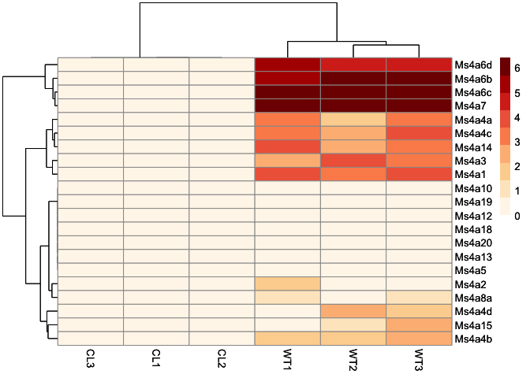
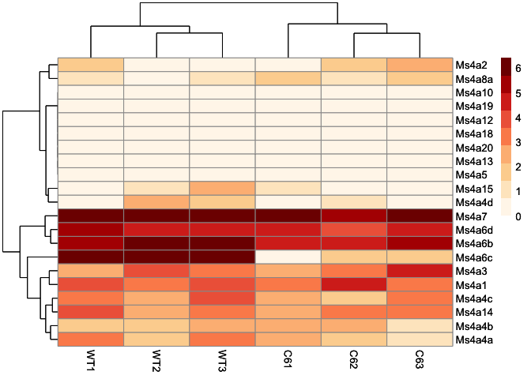

RNAseq analysis
================

## Installation

``` r
#if (!require("BiocManager", quietly = TRUE))
#    install.packages("BiocManager")
#BiocManager::install("DESeq2")
#install.packages("pheatmap","RColorBrewer")
```

## Read input file and generate DESeq2 object

``` r
suppressMessages(library(DESeq2))
# Sample information
sample.meta = data.frame("SampleName" = c(paste0("C6",1:3),
                                          paste0("CL",1:3),
                                          paste0("WT",1:3))
                         ,"Group" = c(rep("6C",3),
                                      rep("CL",3),
                                      rep("WT",3)))
sample.meta
```

    ##   SampleName Group
    ## 1        C61    6C
    ## 2        C62    6C
    ## 3        C63    6C
    ## 4        CL1    CL
    ## 5        CL2    CL
    ## 6        CL3    CL
    ## 7        WT1    WT
    ## 8        WT2    WT
    ## 9        WT3    WT

``` r
# count matrix
mtx = read.table("genes_expression_expected_count.tsv", sep = "\t", header = T, row.names = 1)
mtx = mtx[,-1]
df2 <- data.frame(apply(mtx, 2, function(x) round(x,0))) # round the estiminated count generated by RSEM
head(df2)
```

    ##         C61 C62 C63 CL1 CL2 CL3 WT1 WT2 WT3
    ## Gm9172    0   0   0   0   0   0   0   0   0
    ## Ranbp6  534 327 336 408 238 399 308 426 432
    ## Gm47277   0   0   0   0   0   0   0   0   0
    ## Cd226     4   4  14  11   3   3   4   6   6
    ## Gm34408   2   0   3   0   0   1   0   1   0
    ## Gm38137   0   0   0   1   0   0   0   0   0

``` r
dds <- DESeqDataSetFromMatrix(countData = df2,
                              colData = sample.meta,
                              design= ~ Group)
```

    ## converting counts to integer mode

    ## Warning in DESeqDataSet(se, design = design, ignoreRank): some variables in
    ## design formula are characters, converting to factors

``` r
ntd <- normTransform(dds)
vsd <- vst(dds, blind=FALSE)
```

## Heatmap of Ms4a expression

``` r
library(pheatmap)
library(RColorBrewer)
select <- unique(grep("Ms4a",rownames(ntd), value = T))
p1 = pheatmap(assay(ntd)[select,grep("WT|CL",colnames(assay(ntd)))], cluster_rows=T, show_rownames=T,
             cluster_cols=T, color = brewer.pal(9, "OrRd"))
p1
```

<!-- -->

``` r
p2 = pheatmap(assay(ntd)[select,grep("WT|C6",colnames(assay(ntd)))], cluster_rows=T, show_rownames=T,
             cluster_cols=T, color = brewer.pal(9, "OrRd"))
p2
```

<!-- -->

``` r
sessionInfo()
```

    ## R version 4.3.1 (2023-06-16)
    ## Platform: x86_64-apple-darwin20 (64-bit)
    ## Running under: macOS Ventura 13.2.1
    ## 
    ## Matrix products: default
    ## BLAS:   /Library/Frameworks/R.framework/Versions/4.3-x86_64/Resources/lib/libRblas.0.dylib 
    ## LAPACK: /Library/Frameworks/R.framework/Versions/4.3-x86_64/Resources/lib/libRlapack.dylib;  LAPACK version 3.11.0
    ## 
    ## locale:
    ## [1] en_US.UTF-8/en_US.UTF-8/en_US.UTF-8/C/en_US.UTF-8/en_US.UTF-8
    ## 
    ## time zone: Asia/Taipei
    ## tzcode source: internal
    ## 
    ## attached base packages:
    ## [1] stats4    stats     graphics  grDevices utils     datasets  methods  
    ## [8] base     
    ## 
    ## other attached packages:
    ##  [1] RColorBrewer_1.1-3          pheatmap_1.0.12            
    ##  [3] DESeq2_1.40.2               SummarizedExperiment_1.30.2
    ##  [5] Biobase_2.60.0              MatrixGenerics_1.12.3      
    ##  [7] matrixStats_1.0.0           GenomicRanges_1.52.0       
    ##  [9] GenomeInfoDb_1.36.2         IRanges_2.34.1             
    ## [11] S4Vectors_0.38.1            BiocGenerics_0.46.0        
    ## 
    ## loaded via a namespace (and not attached):
    ##  [1] generics_0.1.3          utf8_1.2.3              bitops_1.0-7           
    ##  [4] lattice_0.21-8          digest_0.6.33           magrittr_2.0.3         
    ##  [7] evaluate_0.21           grid_4.3.1              fastmap_1.1.1          
    ## [10] Matrix_1.5-4.1          fansi_1.0.4             scales_1.2.1           
    ## [13] codetools_0.2-19        abind_1.4-5             cli_3.6.1              
    ## [16] rlang_1.1.1             crayon_1.5.2            XVector_0.40.0         
    ## [19] munsell_0.5.0           DelayedArray_0.26.7     yaml_2.3.7             
    ## [22] S4Arrays_1.0.5          tools_4.3.1             parallel_4.3.1         
    ## [25] BiocParallel_1.34.2     dplyr_1.1.2             colorspace_2.1-0       
    ## [28] ggplot2_3.4.3           locfit_1.5-9.8          GenomeInfoDbData_1.2.10
    ## [31] vctrs_0.6.3             R6_2.5.1                lifecycle_1.0.3        
    ## [34] zlibbioc_1.46.0         pkgconfig_2.0.3         pillar_1.9.0           
    ## [37] gtable_0.3.4            glue_1.6.2              Rcpp_1.0.11            
    ## [40] highr_0.10              tidyselect_1.2.0        xfun_0.40              
    ## [43] tibble_3.2.1            rstudioapi_0.15.0       knitr_1.43             
    ## [46] htmltools_0.5.6         rmarkdown_2.24          compiler_4.3.1         
    ## [49] RCurl_1.98-1.12
